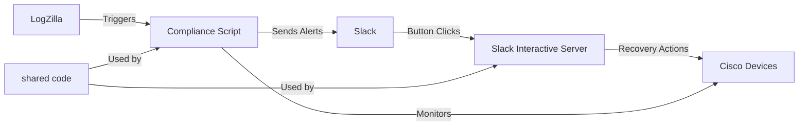

# Cisco Interface Compliance with Slack Integration

A comprehensive solution for monitoring Cisco network device interfaces and providing interactive Slack notifications with recovery capabilities.

## System Overview

This project provides a robust monitoring system for Cisco network devices that:

1. **Monitors Cisco device interfaces** for down or error states
2. **Sends notifications to Slack** with detailed information
3. **Provides interactive buttons** for recovery actions directly within Slack
4. **Integrates with LogZilla** as a script server application

## Architecture

The solution consists of two main components that operate independently:



1. **Compliance Script**: Triggered by LogZilla events to check interface status and send alerts
2. **Slack Interactive Server**: Handles user interactions from Slack notifications for interface recovery
3. **Shared Code**: Common utilities used by both components

Originally built for [LogZilla](https://docs.logzilla.net/02_Creating_Triggers/03_Trigger_Scripts/), this solution can also run as a standalone application.

## Documentation

Detailed documentation for each component is available in the docs directory:

- [Compliance Monitoring Service Documentation](docs/compliance.md) - Core monitoring system
- [Slack Interactive Server Documentation](docs/slackbot.md) - Handling Slack button interactions
- [Deployment Guide](docs/deployment.md) - Step-by-step deployment instructions
- [Developer Guide](docs/developer.md) - Technical details for developers
- [Architecture Diagrams](docs/diagrams.md) - Visual system architecture and flows

## Quick Start

### Prerequisites

- Docker and Docker Compose
- Slack workspace with permissions to create apps
- ngrok account (free tier works for testing)

### Setup

1. Clone this repository
2. Copy the example config files to create your configuration:
   ```bash
   # For the compliance script
   cp compliance/config.yaml.example compliance/config.yaml
   cp compliance/.env.example compliance/.env
   
   # For the slackbot server
   cp slackbot/config.yaml.example slackbot/config.yaml
   cp slackbot/.env.example slackbot/.env
   ```
3. Update each `config.yaml` with your Cisco devices and Slack settings
4. Modify the `.env` files with any environment-specific values

### Deployment

#### Option 1: Run each component independently (recommended)

```bash
# Start the compliance script for LogZilla integration
cd compliance
docker compose up -d

# In a separate terminal, start the Slack interactive button server
cd slackbot
docker compose up -d
```

#### Option 2: Run with Docker Compose project names to avoid orphan warnings

```bash
# Start the compliance script
cd compliance
docker compose -p compliance up -d

# Start the Slack interaction service
cd slackbot
docker compose -p slackbot up -d
```

## Slack Integration

The system integrates with Slack in two ways:

1. **Outgoing notifications**: Formatted alerts with interactive buttons
2. **Incoming actions**: API endpoints that handle button clicks

See the [Slack Interactive Server Documentation](docs/slackbot.md) for details on setting up your Slack App.

## Configuration

The configuration is now separated into component-specific files to allow for independent operation:

### 1. Compliance Script Configuration (`compliance/config.yaml`)

```yaml
# Cisco credentials for bringing interfaces back up
ciscoUsername: "your_cisco_username"
ciscoPassword: "your_cisco_password"

# Slack settings
posturl: "https://hooks.slack.com/services/YOUR/SLACK/WEBHOOK"

# Channel for responses
default_channel: "#network-alerts"
slack_user: "logzilla-bot"

# Interface recovery settings
command_delay: 10
timeout: 10

# Set to true to automatically bring interfaces back up
# Set to false to use interactive buttons via the slackbot
auto_remediate: false
```

### 2. Slackbot Configuration (`slackbot/config.yaml`)

```yaml
# Cisco credentials for bringing interfaces back up
ciscoUsername: "your_cisco_username"
ciscoPassword: "your_cisco_password"

# Slack settings
posturl: "https://hooks.slack.com/services/YOUR/SLACK/WEBHOOK"

# Channel for responses
default_channel: "#network-alerts"
slack_user: "logzilla-bot"

# Slack App ID (found in Basic Information)
slack_app_id: "YOUR_SLACK_APP_ID"

# Interface recovery settings
command_delay: 10
timeout: 10

# Optional Slack verification token for request validation
SLACK_VERIFY_TOKEN: "your_slack_verification_token"

# Flag to enable interactive buttons
use_interactive_buttons: true

# Ngrok URL for interactive buttons (or your permanent URL if in production)
ngrok_url: "https://your-tunnel.ngrok.io"
```

Each component also has an accompanying `.env.example` file that shows which environment variables can be used to override configuration values.

## Support & Contributing

For issues or feature requests, please use the issue tracker or contact the maintainers.

When contributing to this project, please:
1. Fork the repository
2. Create a feature branch
3. Submit a pull request with detailed description

## License

This project is licensed under the terms of the MIT license.
