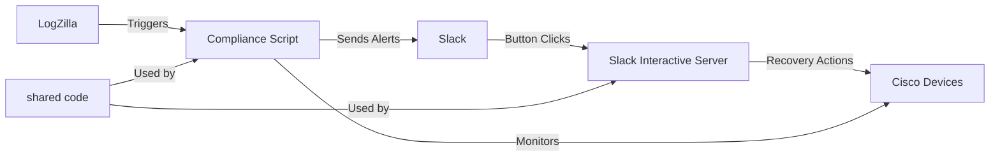

# Cisco Interface Compliance with Slack Integration

YThis repo provides an example of an advanced trigger for logzilla that will add a button to the generated slack message allowing users to decide whether or not to fix the downed interface

## general process

The solution consists of two main components that operate independently:

## Quick Start

### Prerequisites

- Docker and Docker Compose
- Slack workspace with permissions to create apps
- ngrok account (free tier works for testing)

