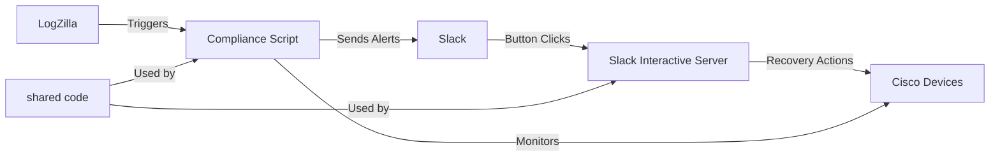

# Cisco Interface Compliance with Slack Integration

This repository provides an enhanced network interface management solution that extends the capabilities of LogZilla's custom trigger functionality with interactive Slack integration. The implementation builds upon the documentation from [LogZilla Custom Triggers](https://docs.logzilla.net/02_Creating_Triggers/03_Trigger_Scripts/), enhancing the interface recovery example with interactive Slack buttons that allow network administrators to approve remediation actions directly from alert notifications.

## Solution Overview

The solution connects LogZilla events to Slack interactive buttons for network interface remediation, allowing operators to choose between automatic or manual interface recovery.

## Documentation

Detailed documentation for this project can be found in the docs/ directory:

- [System Overview & Architecture](docs/README.md) - Complete system overview and architecture details
- [Compliance Script](docs/compliance.md) - Details on the LogZilla trigger compliance script
- [Slack Interactive Server](docs/slackbot.md) - Information about the Slack integration and button handling
- [Deployment Guide](docs/deployment.md) - Instructions for deploying and configuring the system
- [Architecture Diagrams](docs/diagrams.md) - Visual representations of system components and flows

## Quick Start

### Prerequisites

- Docker and Docker Compose
- Slack workspace with permissions to create apps
- ngrok account (free tier works for testing)

