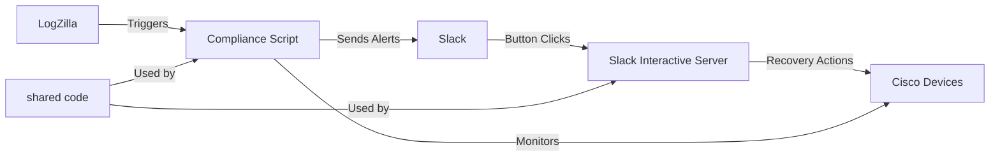

# LogZilla Cisco Interface Compliance - Documentation

## About This Documentation

This document serves as the entry point to the comprehensive technical documentation for the LogZilla Cisco Interface Compliance solution with Slack integration. This documentation is intended for developers, operators, and administrators who need detailed information about the system architecture, components, setup, and operation.

## In-Depth System Architecture

The solution consists of two main components that operate independently but work together to provide the complete functionality:



### Technical Workflow

1. **Event Detection**: LogZilla detects network events through syslog messages
2. **Trigger Activation**: LogZilla trigger executes the compliance script
3. **Event Analysis**: Compliance script parses the event and connects to the device
4. **Slack Notification**: Interactive message with buttons sent to Slack
5. **Operator Decision**: Network operator clicks a button (Fix or Acknowledge)
6. **Callback Processing**: Slack interactive server receives the button click
7. **Remediation**: Server connects to the Cisco device and executes appropriate commands
8. **Status Update**: Server sends confirmation back to Slack

### Components

1. **Compliance Script (LogZilla Trigger)**
   - Triggered by LogZilla events for interface status changes
   - Connects to Cisco devices to verify interface status
   - Sends notifications to Slack with interactive buttons
   - Can be configured for automatic or manual remediation

2. **Slack Interactive Server**
   - Handles button clicks from Slack messages
   - Uses ngrok to expose the service for Slack callbacks
   - Connects to Cisco devices to perform recovery actions
   - Sends status updates back to Slack

## Key Features

- **Enhanced Interface Monitoring**: Detects interface down events via LogZilla triggers
- **Interactive Slack Notifications**: Sends formatted messages with action buttons
- **Manual or Automatic Remediation**: Choose between fully automated or operator-controlled remediation
- **Detailed Status Updates**: Provides clear feedback on remediation actions
- **Robust Error Handling**: Enhanced diagnostic capabilities for connection issues

## How It Differs from LogZilla's Basic Example

| Feature | LogZilla Basic Example | This Implementation |
|---------|------------------------|---------------------|
| Interface Recovery | Automatic only | Choice between automatic or manual |
| Slack Integration | Basic notifications | Interactive buttons |
| User Interaction | None | Can approve or acknowledge issues |
| Deployment | Single container | Separate compliance and interactive services |
| Callback Handling | N/A | Dedicated server with ngrok integration |

## Installation and Setup

### Prerequisites

- Docker and Docker Compose
- Slack workspace with permissions to create apps
- ngrok account (free tier works for testing)
- LogZilla NEO instance

### Deployment Steps

1. **Clone this repository**

2. **Configure the compliance script**

   Copy the example configuration file and update with your details:
   ```bash
   cd compliance
   cp config.yaml.example config.yaml
   # Edit config.yaml with your credentials and settings
   ```

3. **Configure the Slack interactive server**

   Copy the example configuration file and update with your details:
   ```bash
   cd ../slackbot
   cp config.yaml.example config.yaml
   # Edit config.yaml with your credentials and settings
   cp .env.example .env
   # Edit .env with your ngrok auth token and Slack verify token
   ```

4. **Create a Slack App**

   - Create a new Slack App in your workspace
   - Use the provided `slack-app-manifest.yaml` as a template
   - Enable Interactive Components and set the Request URL to your ngrok URL
   - Install the app to your workspace

5. **Deploy the services**

   ```bash
   # Deploy the compliance script service
   cd ../compliance
   docker compose up -d
   
   # Deploy the Slack interactive server
   cd ../slackbot
   docker compose up -d
   ```

6. **Configure LogZilla Trigger**

   - Create a new trigger in LogZilla that matches interface down events
   - Set the trigger action to execute the compliance.py script

## Configuration Options

### Compliance Script Configuration

- `ciscoUsername`: Username for Cisco device access
- `ciscoPassword`: Password for Cisco device access
- `posturl`: Slack webhook URL or bot token
- `default_channel`: Default Slack channel for notifications
- `auto_remediate`: Set to true for automatic remediation, false for interactive mode
- `timeout`: Connection timeout in seconds

### Slack Interactive Server Configuration

- `ciscoUsername`: Username for Cisco device access
- `ciscoPassword`: Password for Cisco device access
- `posturl`: Slack webhook URL or bot token
- `default_channel`: Default Slack channel for notifications
- `use_interactive_buttons`: Must be set to true for button functionality
- `ngrok_url`: Your ngrok tunnel URL
- `SLACK_VERIFY_TOKEN`: Token to validate requests from Slack

## Production Considerations

- Replace ngrok with a permanent URL solution for production use
- Implement proper secrets management for credentials
- Consider using dedicated service accounts for network devices
- Implement more robust request verification for Slack
- Add monitoring for both services to ensure availability

## Development

- Shared code is in the `shared/` directory
- Add new button actions in `slackbot/slack_server.py`
- Modify notification format in `shared/slack_notifier.py`
- Test new interface commands in `shared/cisco_device_manager.py`
