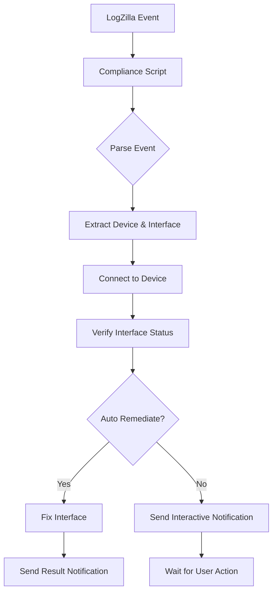

# Compliance Script Documentation

## Overview

The compliance script is the core component that integrates with LogZilla to monitor Cisco interface status changes. When LogZilla detects a relevant event (such as an interface going down), it triggers this script, which then processes the event, connects to the device, and sends notifications through Slack.

## How It Works

### Trigger Mechanism

1. LogZilla receives a syslog message indicating an interface state change
2. LogZilla's trigger system matches the message against configured rules
3. When a match is found, LogZilla executes the compliance script
4. Event details are passed to the script through environment variables

### Processing Flow



### Key Features

- **Event Parsing**: Uses regex to extract interface name and state from event messages
- **Device Connection**: Establishes SSH connections to Cisco devices using Netmiko
- **Diagnostics**: Performs network diagnostics when connection issues occur
- **Interface Recovery**: Can automatically bring interfaces back up if configured
- **Slack Notifications**: Sends detailed, formatted notifications with optional interactive buttons

## Configuration Options

### Required Configuration

```yaml
# Cisco device access credentials
ciscoUsername: "your_cisco_username"
ciscoPassword: "your_cisco_password"

# Slack integration settings
posturl: "https://hooks.slack.com/services/YOUR/SLACK/WEBHOOK"
default_channel: "#network-alerts"
```

### Optional Configuration

```yaml
# Set to true for automatic remediation, false for interactive mode
auto_remediate: false

# Connection and command timing settings
command_delay: 10
timeout: 10

# Slack appearance settings
slack_user: "logzilla-bot"
```

## LogZilla Integration

The script is designed to be triggered by LogZilla and expects the following environment variables:

- `EVENT_HOST`: The hostname of the device reporting the event
- `EVENT_MESSAGE`: The actual message content containing interface details
- `EVENT_SEVERITY`: The severity level of the event (optional)

## Error Handling

The script includes robust error handling for various scenarios:

- **Connection Timeouts**: Performs network diagnostics and sends detailed error reports
- **Authentication Failures**: Reports authentication issues with troubleshooting tips
- **Parsing Failures**: Logs when it cannot extract interface information
- **Command Execution Failures**: Reports when interface commands fail to execute

## Development Guidelines

When modifying the compliance script:

1. Maintain compatibility with LogZilla's environment variable format
2. Test any regex changes against various interface event formats
3. Consider error handling for new network device types
4. Ensure the script exits cleanly to avoid zombie processes
5. Update both automatic and interactive flows when adding new features
