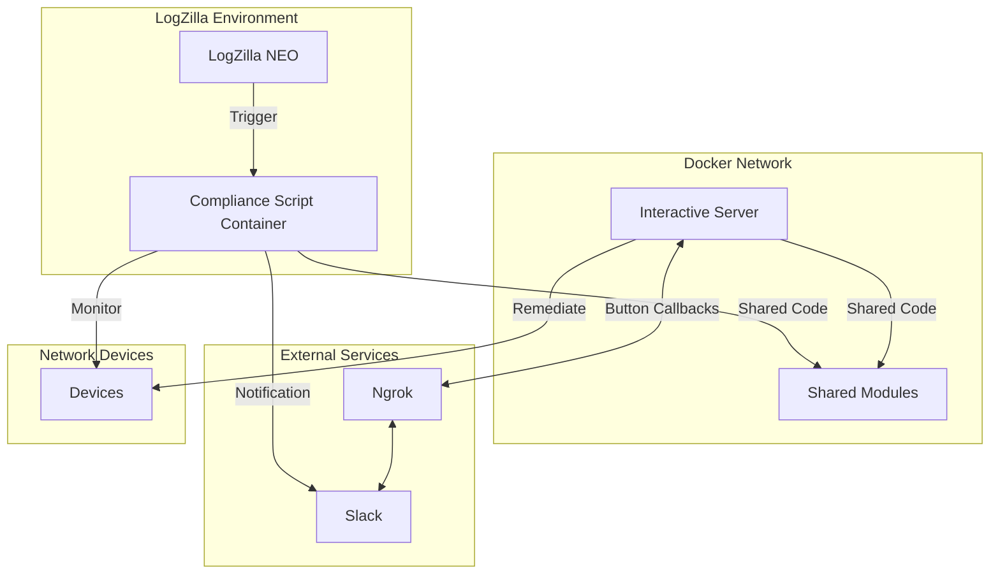

# Deployment Guide

## Overview

This guide covers the deployment process for the Cisco Interface Compliance system with Slack integration. The system consists of two main components that are deployed separately:

1. **Compliance Script Service**: Runs as a Docker container and integrates with LogZilla to monitor interface events
2. **Slack Interactive Server**: Runs as a separate Docker container to handle Slack button callbacks

## Architecture Diagram



## Prerequisites

- Docker Engine (version 20.10+)
- Docker Compose (version 2.0+)
- Git
- Slack workspace with admin access for creating apps
- ngrok account (for development/testing)
- LogZilla NEO instance (version 6.3+)

## Step 1: Clone the Repository

```bash
git clone https://github.com/your-org/lz-compliance.git
cd lz-compliance
```

## Step 2: Configure the Compliance Script

```bash
cd compliance
cp config.yaml.example config.yaml
```

Edit `config.yaml` to include:
- Cisco device credentials
- Slack webhook URL or bot token
- Auto-remediation setting (true/false)
- Timeout and channel settings

## Step 3: Configure the Slack Interactive Server

```bash
cd ../slackbot
cp config.yaml.example config.yaml
cp .env.example .env
```

Edit `config.yaml` to include:
- Cisco device credentials (same as compliance script)
- Slack webhook URL or bot token
- ngrok URL setting (or your permanent URL)
- Enable interactive buttons setting

Edit `.env` to include:
- NGROK_AUTHTOKEN for ngrok authentication
- SLACK_VERIFY_TOKEN for request validation

## Step 4: Create Slack App

1. Go to [api.slack.com/apps](https://api.slack.com/apps) and create a new app
2. Use the provided `slack-app-manifest.yaml` as a template or configure manually:
   - Enable Interactive Components
   - Set the Request URL to your ngrok URL + `/slack/actions`
   - Add necessary OAuth scopes for sending messages
3. Install the app to your workspace

## Step 5: Deploy the Services

### Deploy the Compliance Script:

```bash
cd ../compliance
docker compose up -d
```

Verify the container is running:
```bash
docker ps -a -f name=compliance-script-server
```

### Deploy the Slack Interactive Server:

```bash
cd ../slackbot
docker compose up -d
```

Verify the containers are running:
```bash
docker ps -a -f name=interactive
```

## Step 6: Configure LogZilla Trigger

1. In LogZilla NEO, create a new trigger
2. Configure the trigger to match interface down events (e.g., regex pattern for "Interface X, changed state to down")
3. Set the trigger action to execute the compliance.py script
4. Test the trigger by simulating or generating an interface down event

## Troubleshooting

### Common Issues

- **Script not triggering**: Check LogZilla trigger configuration and verify that environment variables are being passed correctly
- **Slack notifications not sent**: Verify webhook URL or bot token in config.yaml
- **Interactive buttons not working**: Check ngrok URL configuration and Slack app settings
- **Device connection failures**: Check network connectivity and credentials

### Logs

- Compliance script logs: `/var/log/logzilla/scripts/`
- Slack interactive server logs: View with `docker logs interactive-server`
- ngrok logs: View with `docker logs interactive-ngrok`

## Production Considerations

- **Replace ngrok**: Use a permanent URL solution with proper SSL certificates
- **Secrets management**: Use Docker secrets or environment variables for credentials
- **Network security**: Restrict access to the interactive server
- **High availability**: Consider redundant deployments
- **Monitoring**: Implement health checks and alerting for both services

## Updating the Services

To update the services after code changes:

```bash
# Update compliance script
cd compliance
docker compose down
docker compose up -d --build

# Update interactive server
cd ../slackbot
docker compose down
docker compose up -d --build
```
