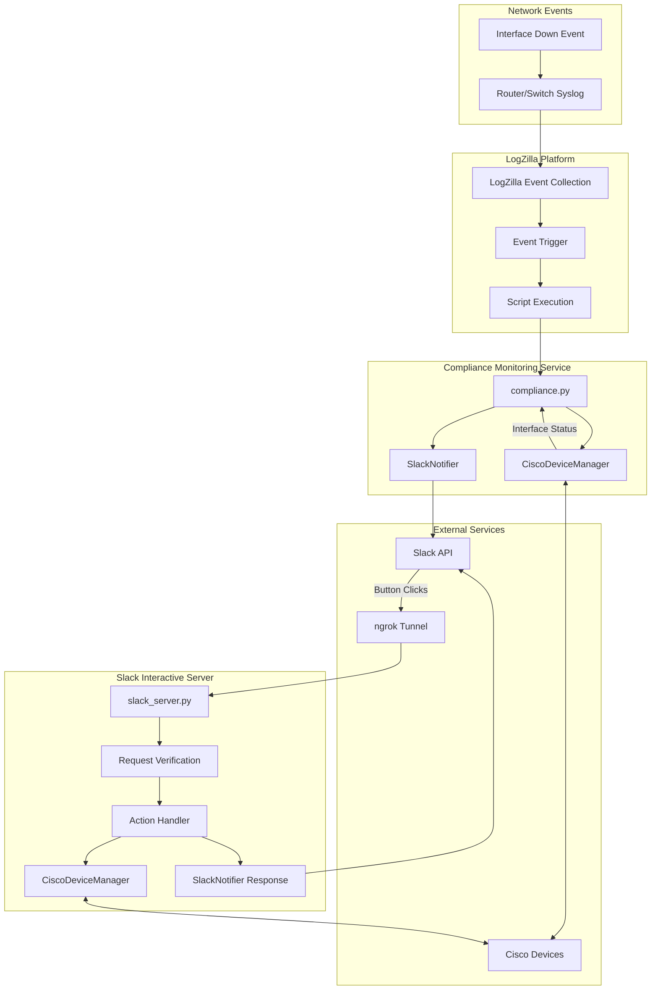
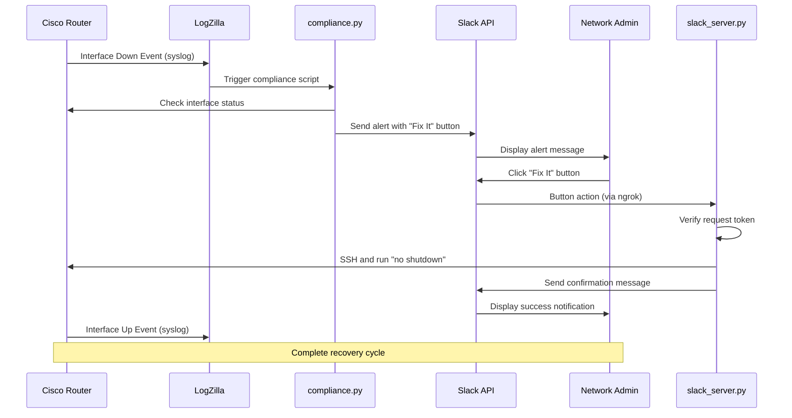
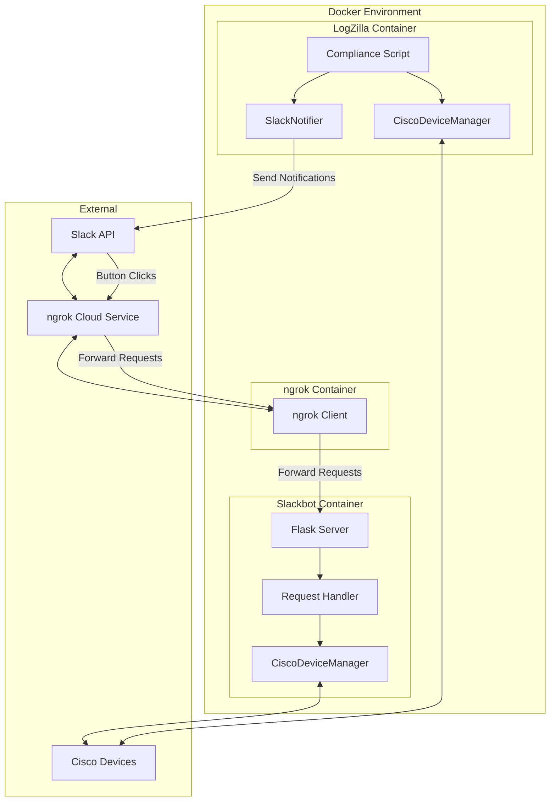
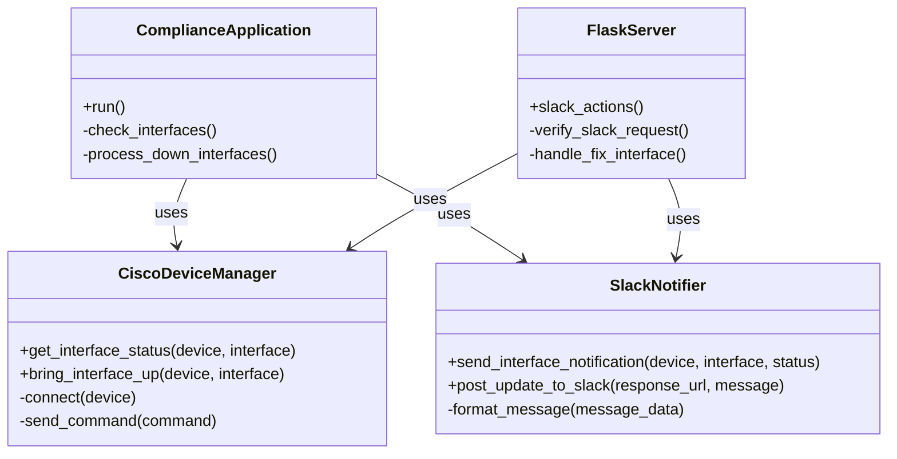

# System Architecture Diagrams

## Complete System Flow

```mermaid
flowchart TD
    subgraph "Network Events"
        A1[Interface Down Event] --> A2[Router/Switch Syslog]
    end

    subgraph "LogZilla Platform"
        B1[LogZilla Event Collection] --> B2[Event Trigger]
        B2 --> B3[Script Execution]
    end
    
    subgraph "Compliance Monitoring Service"
        C1[compliance.py] --> C2[CiscoDeviceManager]
        C1 --> C3[SlackNotifier]
        C2 -- "Interface Status" --> C1
    end
    
    subgraph "Slack Interactive Server"
        D1[slack_server.py] --> D2[Request Verification]
        D2 --> D3[Action Handler]
        D3 --> D4[CiscoDeviceManager]
        D3 --> D5[SlackNotifier Response]
    end
    
    subgraph "External Services"
        E1[Cisco Devices] 
        E2[Slack API]
        E3[ngrok Tunnel]
    end
    
    A2 --> B1
    B3 --> C1
    C2 <--> E1
    C3 --> E2
    E3 --> D1
    D5 --> E2
    D4 <--> E1
    E2 -- "Button Clicks" --> E3
```

## Interface Down Alert and Recovery Flow

```mermaid
sequenceDiagram
    participant Router as Cisco Router
    participant LZ as LogZilla
    participant Script as compliance.py
    participant Slack as Slack API
    participant User as Network Admin
    participant Server as slack_server.py
    
    Router->>LZ: Interface Down Event (syslog)
    LZ->>Script: Trigger compliance script
    Script->>Router: Check interface status
    Script->>Slack: Send alert with "Fix It" button
    Slack->>User: Display alert message
    User->>Slack: Click "Fix It" button
    Slack->>Server: Button action (via ngrok)
    Server->>Server: Verify request token
    Server->>Router: SSH and run "no shutdown"
    Server->>Slack: Send confirmation message
    Slack->>User: Display success notification
    Router->>LZ: Interface Up Event (syslog)
    Note over Router,User: Complete recovery cycle
```

## Deployment Architecture

```mermaid
flowchart TD
    subgraph "Docker Environment"
        subgraph "LogZilla Container"
            A[Compliance Script]
            B[CiscoDeviceManager]
            C[SlackNotifier]
        end
        
        subgraph "Slackbot Container"
            D[Flask Server]
            E[Request Handler]
            F[CiscoDeviceManager]
        end
        
        subgraph "ngrok Container"
            G[ngrok Client]
        end
    end
    
    subgraph "External"
        H[Cisco Devices]
        I[Slack API]
        J[ngrok Cloud Service]
    end
    
    A --> B
    A --> C
    C -- "Send Notifications" --> I
    B <--> H
    G <--> J
    J <--> I
    I -- "Button Clicks" --> J
    J -- "Forward Requests" --> G
    G -- "Forward Requests" --> D
    D --> E
    E --> F
    F <--> H
```

## Component Dependencies

```mermaid
classDiagram
    class ComplianceApplication {
        +run()
        -check_interfaces()
        -process_down_interfaces()
    }
    
    class CiscoDeviceManager {
        +get_interface_status(device, interface)
        +bring_interface_up(device, interface)
        -connect(device)
        -send_command(command)
    }
    
    class SlackNotifier {
        +send_interface_notification(device, interface, status)
        +post_update_to_slack(response_url, message)
        -format_message(message_data)
    }
    
    class FlaskServer {
        +slack_actions()
        -verify_slack_request()
        -handle_fix_interface()
    }
    
    ComplianceApplication --> CiscoDeviceManager : uses
    ComplianceApplication --> SlackNotifier : uses
    FlaskServer --> CiscoDeviceManager : uses
    FlaskServer --> SlackNotifier : uses
```
