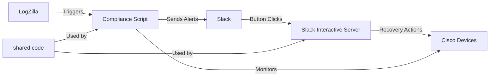
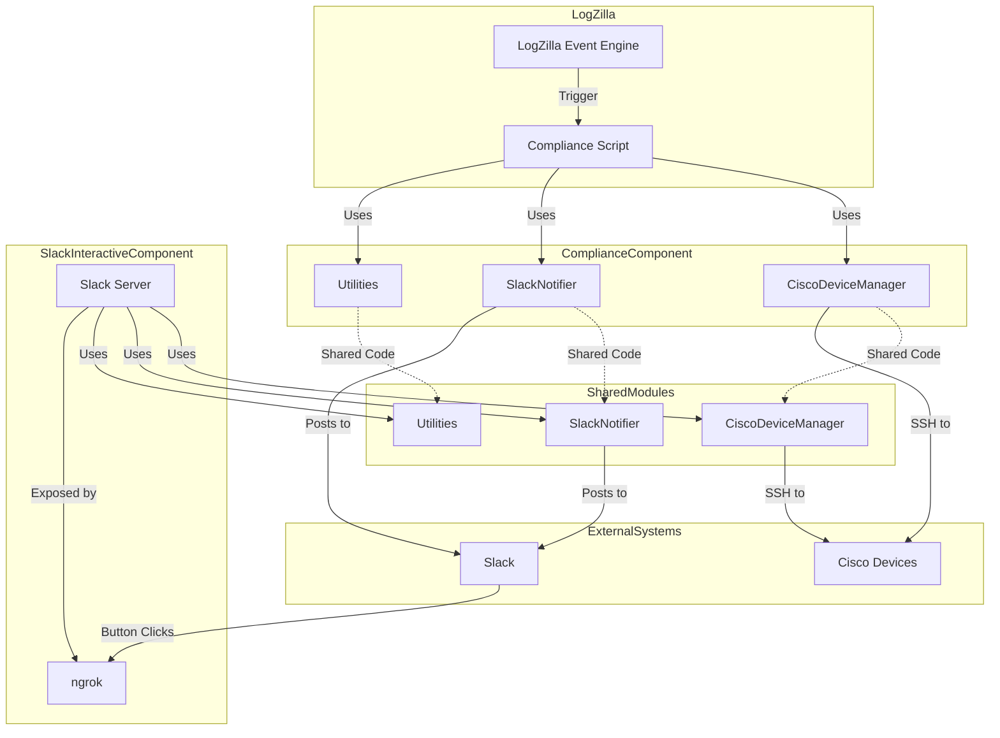
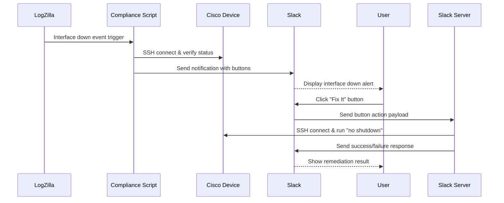
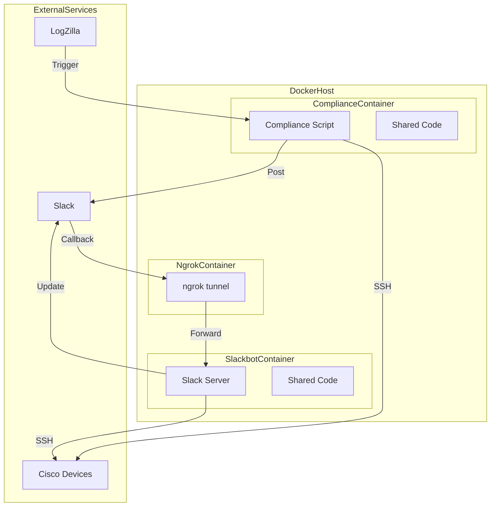
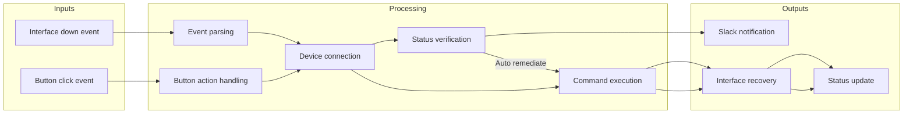
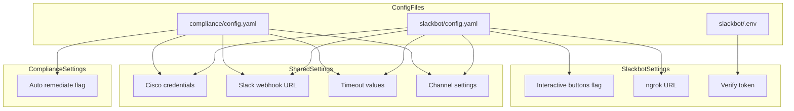

# Architecture Diagrams

## System Overview

```mermaid
flowchart LR
    A[Compliance Script] -->|Sends Alerts| B[Slack]
    B -->|Button Clicks| C[Slack Interactive Server]
    C -->|Recovery Actions| D[Cisco Devices]
    A -->|Monitors| D
    E[LogZilla] -->|Triggers| A
    F[shared code] -->|Used by| A
    F -->|Used by| C
```

## Detailed Component Architecture

```mermaid
flowchart TD
    subgraph LogZilla
        LZ[LogZilla Event Engine] -->|Trigger| CS[Compliance Script]
    end
    
    subgraph ComplianceComponent
        CS -->|Uses| CDM1[CiscoDeviceManager]
        CS -->|Uses| SN1[SlackNotifier]
        CS -->|Uses| UT1[Utilities]
    end
    
    subgraph SharedModules
        CDM1 -.->|Shared Code| CDM2[CiscoDeviceManager]
        SN1 -.->|Shared Code| SN2[SlackNotifier]
        UT1 -.->|Shared Code| UT2[Utilities]
    end
    
    subgraph SlackInteractiveComponent
        SS[Slack Server] -->|Uses| CDM2
        SS -->|Uses| SN2
        SS -->|Uses| UT2
        SS -->|Exposed by| NG[ngrok]
    end
    
    subgraph ExternalSystems
        SN1 -->|Posts to| S[Slack]
        SN2 -->|Posts to| S
        S -->|Button Clicks| NG
        CDM1 -->|SSH to| CD[Cisco Devices]
        CDM2 -->|SSH to| CD
    end
```

## Event Flow Sequence

```mermaid
sequenceDiagram
    participant LZ as LogZilla
    participant CS as Compliance Script
    participant CD as Cisco Device
    participant S as Slack
    participant U as User
    participant SS as Slack Server
    
    LZ->>CS: Interface down event trigger
    CS->>CD: SSH connect & verify status
    CS->>S: Send notification with buttons
    S-->>U: Display interface down alert
    U->>S: Click "Fix It" button
    S->>SS: Send button action payload
    SS->>CD: SSH connect & run "no shutdown"
    SS->>S: Send success/failure response
    S-->>U: Show remediation result
```

## Deployment Architecture

```mermaid
graph TD
    subgraph DockerHost
        subgraph ComplianceContainer
            CS[Compliance Script]
            SC1[Shared Code]
        end
        
        subgraph SlackbotContainer
            SS[Slack Server]
            SC2[Shared Code]
        end
        
        subgraph NgrokContainer
            NG[ngrok tunnel]
        end
    end
    
    subgraph ExternalServices
        LZ[LogZilla]
        S[Slack]
        CD[Cisco Devices]
    end
    
    LZ -->|Trigger| CS
    CS -->|SSH| CD
    CS -->|Post| S
    S -->|Callback| NG
    NG -->|Forward| SS
    SS -->|SSH| CD
    SS -->|Update| S
```

## Data Flow Diagram

```mermaid
flowchart LR
    subgraph Inputs
        E1[Interface down event]
        E2[Button click event]
    end
    
    subgraph Processing
        P1[Event parsing]
        P2[Device connection]
        P3[Status verification]
        P4[Button action handling]
        P5[Command execution]
    end
    
    subgraph Outputs
        O1[Slack notification]
        O2[Interface recovery]
        O3[Status update]
    end
    
    E1 --> P1 --> P2 --> P3 --> O1
    P3 -->|Auto remediate| P5 --> O2 --> O3
    E2 --> P4 --> P2 --> P5 --> O2 --> O3
```

## Configuration Structure

```mermaid
graph TD
    subgraph ConfigFiles
        C1[compliance/config.yaml]
        C2[slackbot/config.yaml]
        C3[slackbot/.env]
    end
    
    subgraph SharedSettings
        S1[Cisco credentials]
        S2[Slack webhook URL]
        S3[Timeout values]
        S4[Channel settings]
    end
    
    subgraph ComplianceSettings
        CS1[Auto remediate flag]
    end
    
    subgraph SlackbotSettings
        SS1[Interactive buttons flag]
        SS2[ngrok URL]
        SS3[Verify token]
    end
    
    C1 --> S1
    C1 --> S2
    C1 --> S3
    C1 --> S4
    C1 --> CS1
    
    C2 --> S1
    C2 --> S2
    C2 --> S3
    C2 --> S4
    C2 --> SS1
    C2 --> SS2
    
    C3 --> SS3
```
