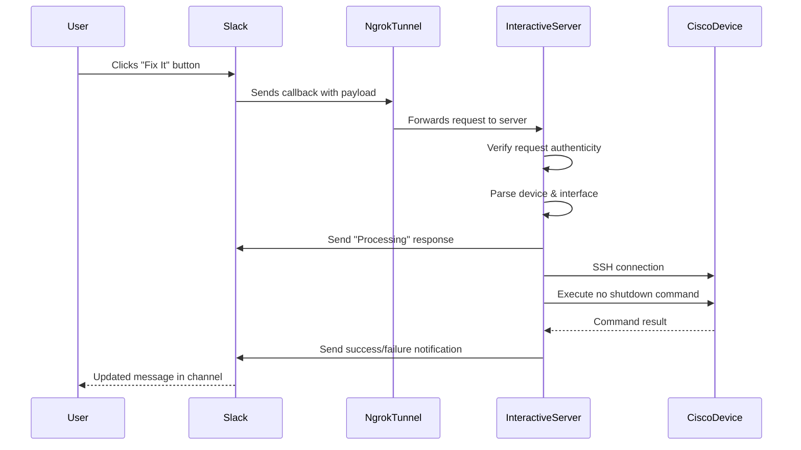

# Slack Interactive Server Documentation

## Overview

The Slack interactive server is a key component that extends the basic LogZilla custom script functionality by enabling interactive remediation through Slack buttons. This server receives and processes button clicks from Slack messages, then connects to Cisco devices to perform the requested actions.

## How It Works

### Button Callback Flow



### Key Features

- **Request Verification**: Validates incoming requests are legitimate Slack callbacks
- **Button Action Handling**: Processes different button actions (fix, acknowledge)
- **Device Interaction**: Uses shared CiscoDeviceManager for device connections
- **Immediate Feedback**: Sends immediate acknowledgments and final results to Slack
- **Error Handling**: Robust error reporting for connection or command failures

## Configuration

### Required Configuration

```yaml
# Cisco device access credentials
ciscoUsername: "your_cisco_username"
ciscoPassword: "your_cisco_password"

# Slack integration settings
posturl: "https://hooks.slack.com/services/YOUR/SLACK/WEBHOOK"
default_channel: "#network-alerts"

# Interactive button settings
use_interactive_buttons: true
ngrok_url: "https://your-tunnel.ngrok.io"
```

### Optional Configuration

```yaml
# Slack verification
SLACK_VERIFY_TOKEN: "your_slack_verification_token"

# Performance settings
timeout: 10
command_delay: 5

# Appearance settings
slack_user: "logzilla-bot" 
```

## Ngrok Integration

The server requires public internet accessibility to receive callbacks from Slack. This is achieved using ngrok:

1. The ngrok service creates a secure tunnel to the interactive server
2. Slack sends button click events to the ngrok URL
3. Ngrok forwards these requests to the local server

In production, ngrok should be replaced with a permanent URL solution.

## Slack App Configuration

A Slack app must be created with:

1. Interactive Components enabled
2. Request URL set to your ngrok URL + `/slack/actions` path
3. Appropriate OAuth scopes for sending messages

The included `slack-app-manifest.yaml` provides a template for the required configuration.

## Security Considerations

The current implementation includes basic request verification using a token. For production use, consider:

1. Implementing Slack's full request signing verification
2. Using HTTPS for all communications
3. Restricting access to the interactive server
4. Implementing rate limiting for button actions

## Adding New Button Actions

To add a new interactive button action:

1. Add the button to the `send_interface_notification` method in `SlackNotifier`
2. Create a handler function in `slack_server.py`
3. Add the action to the routing logic in the `slack_actions` function
4. Update the action value format if additional parameters are needed

## Error Handling

The server includes error handling for:

- Invalid request formats
- Connection failures to Cisco devices
- Command execution failures
- Response URL errors when updating Slack messages
